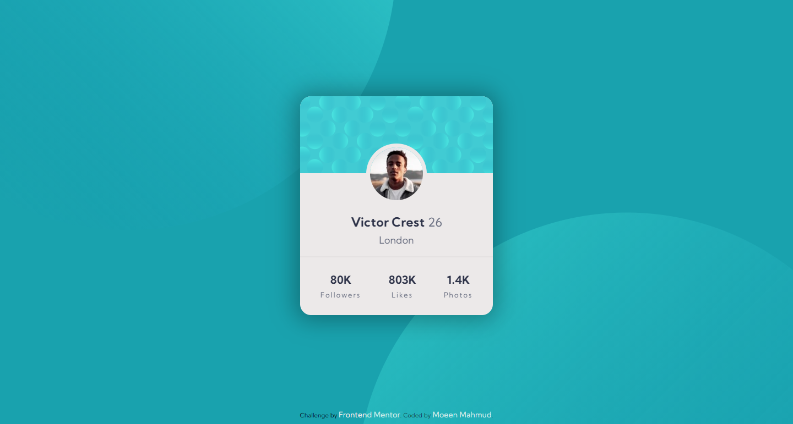

# Frontend Mentor - Profile card component solution

This is a solution to the [Profile card component challenge on Frontend Mentor](https://www.frontendmentor.io/challenges/profile-card-component-cfArpWshJ). Frontend Mentor challenges help you improve your coding skills by building realistic projects.

## Table of contents

- [Overview](#overview)
  - [The challenge](#the-challenge)
  - [Screenshot](#screenshot)
  - [Links](#links)
- [My process](#my-process)
  - [Built with](#built-with)
  - [What I learned](#what-i-learned)
  - [Continued development](#continued-development)
  - [Useful resources](#useful-resources)
- [Author](#author)

## Overview

### The challenge

Users should be able to view the optimal layout depending on their device's screen size

### Screenshot



### Links

- Solution URL: [GitRepo](https://github.com/moeen-mahmud/profile-card-component)
- Live Site URL: [LiveSite](https://moeen-profile-card-component.netlify.app/)

## My Process

### Built With

- Semantic HTML5 markup
- CSS custom properties
- Flexbox
- Mobile-first workflow
- [GoogleFonts](https://fonts.google.com/) - For font styles

### What I learned

In this project I learn how to use background image as svg and how to properly layout them for optimal cross-platform view.

```css
.background_image--top {
  position: fixed;
  bottom: 45%;
  right: 50%;
}

.background_image--bottom {
  position: fixed;
  top: 50%;
  left: 45%;
}
```

### Continued Development

This is my second project from **Frontendmentor**, following my previous [project](https://moeen-stats-preview-card-component.netlify.app/).

### Useful resources

- [Conquering_Responsive_Layouts](https://courses.kevinpowell.co/) - This is a great course from [Kevin](https://twitter.com/KevinJPowell), I learned a lot how to layout a website with some interesting way!

- [MDN](https://developer.mozilla.org/en-US/) - My go to solution if I got stuck in some cases.

## Author

- Frontend Mentor - [fahim-mahmud](https://www.frontendmentor.io/profile/fahim-mahmud)
- Twitter - [moeen_mahmud](https://twitter.com/moeen_mahmud)
